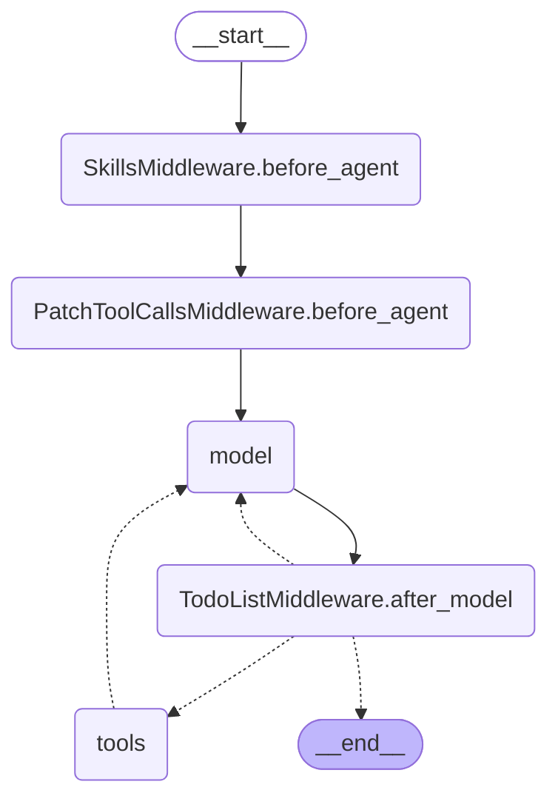

# Compiled Agent Graph

Both registered graphs — `monet_agent` (chat, `agent.py:graph`) and `autonomous_loop`
(`autonomy.py:autonomous_graph`) — compile to the **identical** topology below. They are
both built by `deepagents.create_deep_agent(...)`; only the bound tool set
(`CHAT_TOOLS` vs `AUTONOMOUS_TOOLS`) and system prompt differ.

Regenerate with:

```bash
cd agent && python -c "from dotenv import load_dotenv; load_dotenv('.env'); \
from stock_agent.autonomy import autonomous_graph; \
open('docs/agent_graph.mmd','w').write(autonomous_graph.get_graph().draw_mermaid())"
```



## Reading it

- **Setup (once per run):** `__start__` → `SkillsMiddleware.before_agent` (exposes `/skills/`)
  → `PatchToolCallsMiddleware.before_agent` (repairs dangling tool calls) → `model`.
- **ReAct loop (dashed = conditional):** `model` → `TodoListMiddleware.after_model` routes to
  `tools` (run tool calls, then back to `model`), back to `model`, or `__end__` when the LLM
  emits no further tool calls.
- There are no `research`/`analyze`/`decide`/`execute`/`reflect` nodes — that sequencing is
  prompt/skill-driven inside this single loop.

The raw `draw_mermaid()` output (with `\2e`-escaped dots) is in `agent_graph.mmd`.
